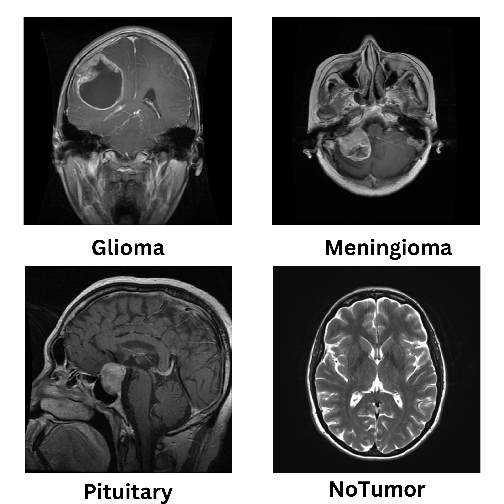
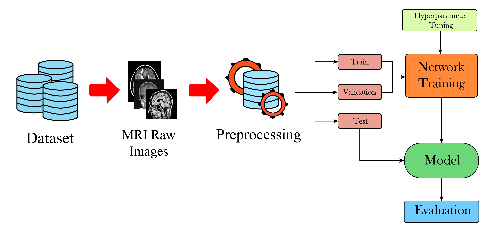
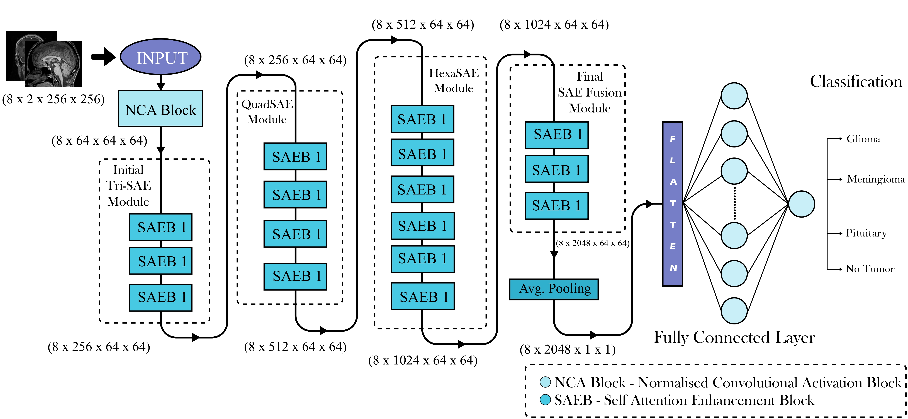
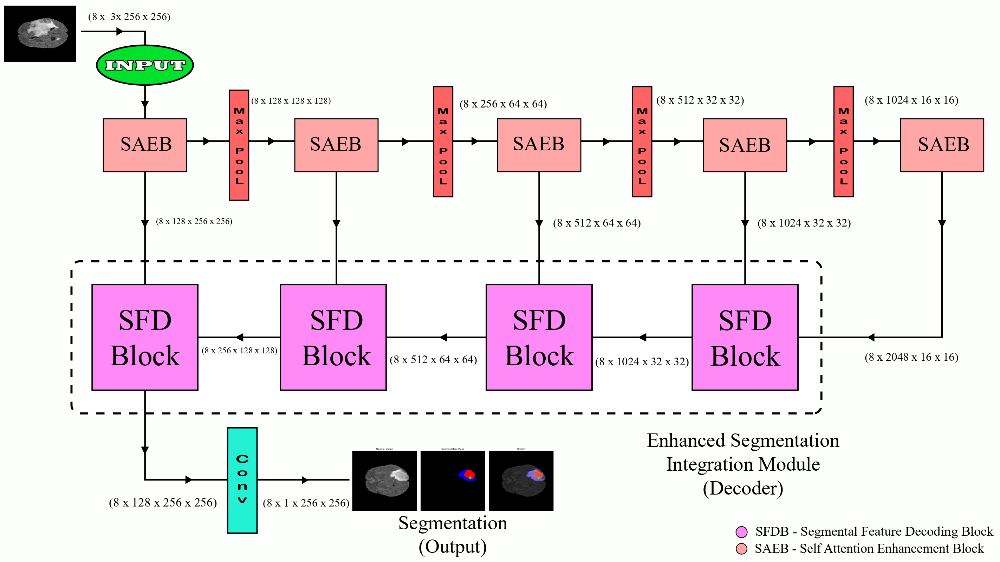

# Novel Deep Learning Architectures for Classification and Segmentation of Brain Tumors from MRI Images

## 📄 Abstract & Overview

This research paper introduces a **Computer-Aided Diagnosis (CAD)** system featuring two novel Deep Learning architectures, **SAETCN** and **SAS-Net**, designed to enhance the accuracy and efficiency of detecting, classifying, and segmenting brain tumors from **MRI images**. The models address the limitations of existing approaches, which often suffer from poor generalization and low validation performance, achieving state-of-the-art results on multiple datasets.

---

## 💡 Introduction to Brain Tumors

Brain tumors represent a significant health challenge, classified by their origin, aggressiveness, and location. Accurate and timely diagnosis is critical for effective treatment planning. The three most common types of brain tumors addressed by this study include:

* **Glioma:** These tumors arise from glial cells (supportive tissue of the brain and spinal cord). They are often highly aggressive and challenging to treat.
* **Meningioma:** These tumors originate in the meninges, the membranes that surround the brain and spinal cord. They are usually benign (non-cancerous) and slow-growing.
* **Pituitary:** These tumors develop in the pituitary gland, a small gland at the base of the brain. They are typically benign but can cause hormonal imbalances and vision problems due to compression.

The emergence of AI, particularly Deep Learning, offers a powerful tool to automate and improve the laborious process of tumor detection and characterization from medical images.

---





## 🧠 Proposed Novel Architectures

The framework is built upon the integration of **self-attention mechanisms** to facilitate robust and focused feature extraction in medical imaging data.

### 1. SAETCN (Self-Attention Enhancement Tumor Classification Network)

* **Task:** **Classification** of brain tumors into four categories: **Glioma, Meningioma, Pituitary, and No Tumor (Normal)**.
* **Core Structure:** A deep Convolutional Neural Network (CNN) that merges concepts from **Residual** and **Inception** networks.
* **Key Component:** The **Self Attention Enhancement Block (SAEB)**, which uses skip connections and parallel convolution branches to capture complex, multi-scale spatial features while maintaining efficient gradient flow.
* **Performance:** Achieved an impressive classification accuracy of **99.38%** on the validation dataset.



### 2. SAS-Net (Self-Attentive Segmentation Network)

* **Task:** **Segmentation** (precise pixel-wise delineation) of the tumor region within the brain MRI.
* **Key Component:** The **Segmental Feature Decoder Block (SFD Block)**, which serves as a decoder to enhance feature map resolution through sophisticated upsampling and feature integration.
* **Integration:** The SFD block contains a complex **Residual Inception module** to combine features at various scales effectively, leading to highly accurate boundary detection.
* **Performance:** Demonstrated an overall pixel accuracy of **99.23%**.



---

## 💻 Technical Details

| Feature | Description |
| :--- | :--- |
| **Implementation** | The models were implemented using the **PyTorch** deep learning framework. |
| **Datasets** | Multiple datasets were used, including a combination of Figshare, SARTAJ, and Br35H for classification, and the **BratS2020** dataset for segmentation. |
| **Key Techniques** | Self-Attention, Residual Connections, Inception Modules. |
| **Evaluation Metrics** | Precision, F1 Score, Recall, ROC-AUC (for classification), and Intersection Over Union (IoU), Dice Similarity Coefficient (DSC), Boundary F1 Score (for segmentation). |

---

## 🔗 Repository and Software Links

The computational codes and model architectures are publicly available. The ultimate goal is to integrate these architectures into an accessible CAD system.

| Resource Type | Link |
| :--- | :--- |
| **Code Repository** | [SAETCN and SAS-NET Architectures (GitHub)](https://github.com/arghadip2002/SAETCN-and-SASNET-Architectures) |
| **Live Software Demo (NeuroGuard Web App)** | [NeuroGuard Web Application (Hugging Face Space)](https://huggingface.co/spaces/arghadip2002/NeuroGuard-Web-Application) |
| **Code Repo of NeuroGuard Web App** | [Github Repo](https://github.com/arghadip2002/NeuroGuard-Web-Application) |


---

## 👨‍💻 Authors

* **[Arghadip Biswas](https://github.com/arghadip2002)**
    * Affiliation: Jadavpur University, Kolkata, India
    * GitHub ID: `arghadip2002`
* **[Sayan Das](https://github.com/Necromancer0912)**
    * Affiliation: IIIT Delhi, Delhi, India
    * GitHub ID: `Necromancer0912`

---

## 📧 Contact

* **Arghadip Biswas:** mrarghadipofficial@gmail.com
* **Sayan Das:** sayan20012002@gmail.com

---

## 📁 Repository Structure

This repository is organized into the following main directories:

### Classification Model SAETCN
Contains Jupyter notebooks for training and evaluating the SAETCN architecture:
- `main-model-b-classification-full.ipynb` - Full SAETCN architecture implementation
- `main-model-b-classification-nca.ipynb` - SAETCN with NCA (Neighborhood Component Analysis)
- `main-model-b-classification-nca-trisae.ipynb` - SAETCN variant with triple SAE blocks
- `main-model-b-classification-nca-tri-quadsae.ipynb` - SAETCN with triple and quadruple SAE blocks
- `main-model-b-classification-nca-tri-quad-hexa.ipynb` - Extended SAETCN with multiple SAE configurations

### Segmentation Model SASNET
Contains the implementation for the SAS-Net segmentation architecture:
- `brain_tumor_segmentation_custom_1_with_masked.ipynb` - SAS-Net training and evaluation notebook

### Visualisation
Contains architecture diagrams and visualizations used in the paper and this README.

---

## 🚀 Getting Started

### Prerequisites
- Python 3.8+
- PyTorch 1.10+
- CUDA-enabled GPU (recommended for training)
- Jupyter Notebook or JupyterLab

### Dataset Access
- Classification datasets: See `dataLinks` file for download URLs
- Segmentation dataset (BraTS2020): Available on Kaggle
- Pre-trained model weights: Available in `Model Links` file (Google Drive)

### Usage
1. Clone this repository
2. Download the datasets using the links provided in the `dataLinks` file
3. Download pre-trained models from the Google Drive link in `Model Links` file
4. Open the respective Jupyter notebooks for classification or segmentation tasks
5. Follow the instructions within each notebook to train or evaluate the models

---

## 📜 Citation & Academic Acknowledgment

This repository contains the official training and evaluation code for the **SAETCN** and **SAS-Net** architectures.

If you use this code, the weights, or the underlying methodologies described here in your own academic research, please cite the original paper:

### ✍️ Preferred Citation (BibTeX)

```bibtex
@article{das2025novel,
  title={Novel Deep Learning Architectures for Classification and Segmentation of Brain Tumors from MRI Images},
  author={Das, Sayan and Biswas, Arghadip},
  journal={arXiv preprint arXiv:2512.06531},
  year={2025}
}
```

### 🔗 Paper Link
The full paper is publicly available on the arXiv preprint server: [arXiv:2512.06531](https://www.arxiv.org/abs/2512.06531)
